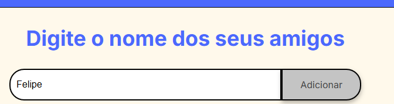
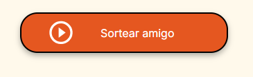
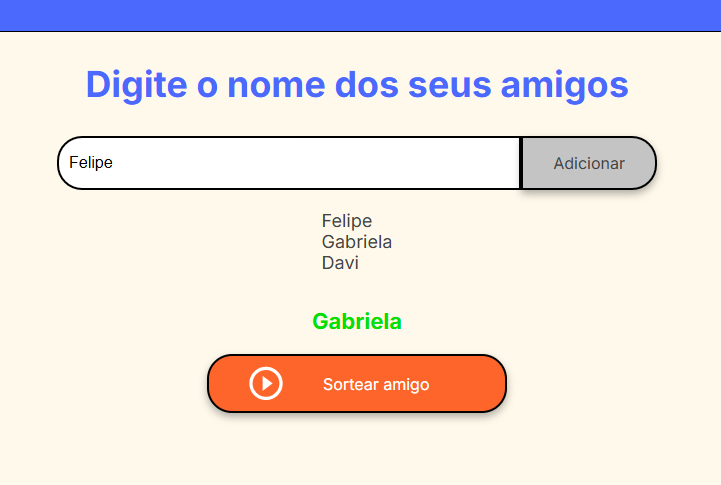

# 🎁 Amigo Secreto - Sorteador
Este é um projeto inicial feito para o **Bootcamp Oracle ONE (Programa ONE)** em parceria com a Alura.

## 🚀 O que ele faz?
Ele te ajuda a sortear quem vai tirar quem no seu Amigo Secreto!

## ✨ Visão Geral

Aqui está uma imagem de como o aplicativo se parece:

## ✨ Como usar?

Para começar a usar, siga estes passos simples:

1.  **Adicione os nomes:**
    * No campo de texto, digite o nome de cada participante.
    * Em seguida, clique no botão "Adicionar".

    

    * À medida que você adiciona, os nomes aparecerão logo abaixo do campo de entrada.
    * Exemplo de nomes adicionados:

    

2.  **Sortear:**
    * Depois que todos os nomes estiverem na lista, clique no botão grande "Sortear amigo".

    

3.  **Resultado:**
    * O nome sorteado aparecerá na tela, mostrando quem foi o amigo tirado!

    

## 💻 Tecnologias usadas
* **HTML:** Para a estrutura da página.
* **CSS:** Para deixar a página bonita.
* **JavaScript:** Para fazer a mágica de adicionar nomes e sortear.
