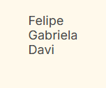

# 🎁 Amigo Secreto - Sorteador

Este é um projeto inicial feito para o **Bootcamp Oracle ONE (Programa ONE)** em parceria com a Alura.

## 🚀 O que ele faz?

Ele te ajuda a sortear quem vai tirar quem no seu Amigo Secreto!

## ✨ Visão Geral

Tela inicial:

## ✨ Como usar?

Para começar a usar, siga estes passos:

1.  **Adicione os nomes:**

    * No campo de texto, digite o nome de cada participante.

    * Em seguida, clique no botão "Adicionar".

    

    * À medida que você adiciona, os nomes aparecerão logo abaixo do campo de entrada.

    * Exemplo de nomes adicionados:

    

2.  **Sortear:**

    * Depois que todos os nomes estiverem na lista, clique no botão "Sortear amigo".

    

3.  **Resultado:**

    * O nome sorteado aparecerá na tela, mostrando quem foi o amigo tirado!

    

## 💻 Tecnologias usadas

* **HTML:**

* **CSS:**

* **JavaScript:**